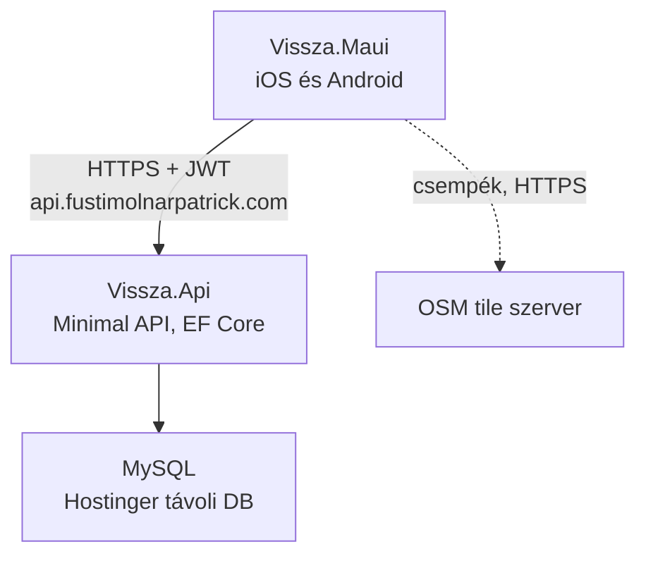
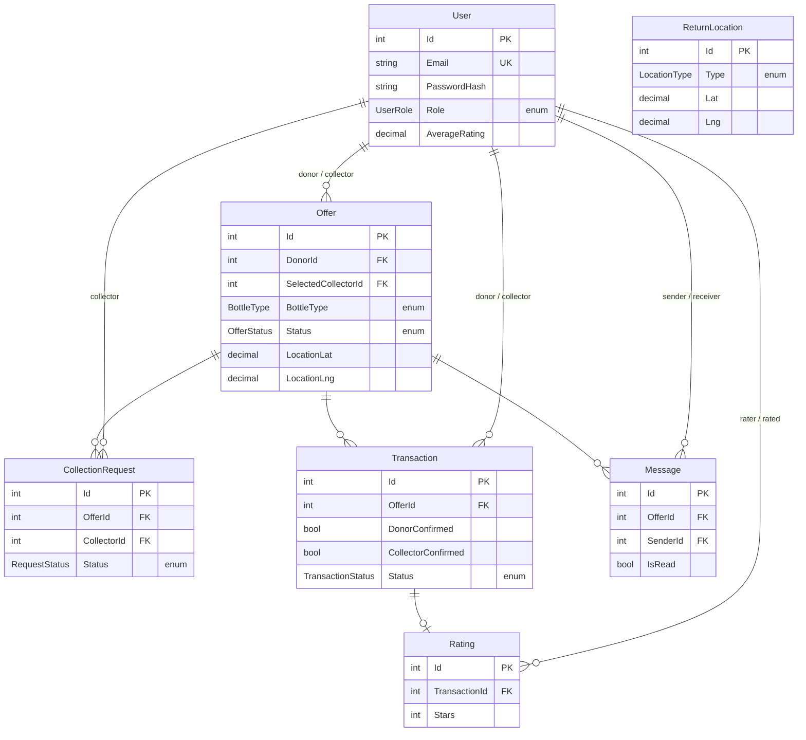

# ÜvegVissza — .NET MAUI migrációs terv

> Ez a dokumentum a React Native alapú `Desktop/vissza` projekt .NET MAUI-ra
> történő átírásának terve. A meglévő projekt nem módosul; a munka ebben a
> külön repóban folyik.
>
> Készült: 2026-08-01 · Utolsó módosítás: 2026-08-13
> (a változásokat lásd a [11. fejezetben](#11-módosítási-napló))

---

## 1. Döntési napló

Ez a fejezet azt rögzíti, **miért** ez az architektúra — hogy fél év múlva ne
kelljen újra végigvitatni.

### 1.1 A cél

Egy .NET megoldás, egy nyelv, egy repo, egy deploy. Ne kelljen két külön
technológiai stacket (Node + React Native) karbantartani, és ne kelljen külön
gondolkodni a "frontend" és a "backend" projektről.

### 1.2 Elvetett: az app közvetlenül az adatbázishoz kapcsolódik

Az eredeti elképzelés az volt, hogy a MAUI code-behindból közvetlenül lehessen
lekérdezni a MySQL-t, backend nélkül — ahogy egy belsős LOB alkalmazásnál
szokás. **Elvetve**, három okból:

> **Javítva 2026-08-13.** Eredetileg negyedik indokként az szerepelt, hogy a
> direkt kapcsolat nem spórol hostingot. Ez ebben a setupban **téves volt**: a
> Hostinger csomag a távoli MySQL-t adja, tehát backend nélkül tényleg nem
> kellene semmit hozzátenni. Az alábbi három indok viszont önmagában is döntő.

1. **A connection string a felhasználó telefonjára kerülne.** Az APK/IPA
   visszafejtése triviális, a .NET IL assembly-k különösen. Ezzel bárki, aki
   telepítette az appot, hozzáférne minden felhasználó `email`, `phone`,
   `password_hash` és `default_address` mezőjéhez, az összes privát üzenethez,
   és tetszőlegesen módosíthatná vagy törölhetné az adatokat.
2. **Az üzleti szabályok kikényszeríthetetlenek lennének.** A kétoldalú átvételi
   megerősítés, a login rate limit és a tranzakciós atomicitás mind olyasmi, ami
   csak akkor ér valamit, ha a kliens nem tudja megkerülni.
3. **Connection pool.** Ma egyetlen kliens (a backend) tart 10 kapcsolatot.
   Direkt kapcsolódásnál minden telefon önálló kliens; a MySQL alapértelmezett
   `max_connections` értéke 151. Néhány száz egyidejű felhasználónál a szerver
   elutasítaná az új kapcsolatokat.

A LOB minta helyes — ott a kliens ismert gépen, zárt hálózaton fut. Itt idegenek
futtatják saját telefonon, publikus áruházból. Ez az egy változó dönt.

### 1.3 Elvetett: Blazor Server

Egyetlen ASP.NET Core projekt, a `.razor` fájl `@code` blokkjában közvetlen EF
Core lekérdezéssel — ez adná a legközelebbi élményt a LOB mintához, és a
térképréteget is megoldaná (Leaflet/MapLibre, tetszőleges HTML marker).
**Elvetve**, mert natív alkalmazás kell az App Store-ba és a Play Store-ba.

### 1.4 Elfogadott: MAUI + ASP.NET Core Minimal API egy solutionben

Egy `.sln`, három projekt, egy repo, egy deploy. A `Shared` projekt miatt a
szerver és a kliens fordítási időben ugyanazokat a típusokat használja — ez az,
amit a mostani JS/JS felállás nem tud nyújtani.

### 1.5 Elfogadott: a térkép Mapsui + OpenStreetMap

Lásd a [7. fejezetet](#7-térkép-mapsui--openstreetmap).

Az első döntés a **platform handler** volt: a MAUI beépített `Map` kontrollját
szabtuk volna testre, platformonkénti kóddal. Ezt **felülírta** az a követelmény,
hogy semmilyen szinten ne legyen API kulcs — a MAUI `Map` ugyanis Androidon a
Google Maps SDK-ra épül, ami kulcs nélkül el sem indul.

Ezért a döntés a **Mapsui**: OSM tile-ok, kulcs nélkül, saját markerek tisztán
C#-ból, és **nulla platformspecifikus fájl**. Kevesebb munka, mint a handler, és
teljesíti a kulcsmentességet.

### 1.6 Elfogadott: domain és HTTPS a meglévő Hostinger csomagon

A `fustimolnarpatrick.com` domain már megvan, és a Hostinger automatikusan
kiállítja rá a Let's Encrypt tanúsítványt (ellenőrizve 2026-08-13-án: érvényes
2026-10-19-ig, automatikus megújítással). Az API egy `api.fustimolnarpatrick.com`
aldomaint kap ugyanezzel a mechanizmussal.

Így a telefonban **nem IP-cím** lesz beégetve, hanem név. Szerverváltásnál egy
DNS-rekord átírása elég; IP-vel minden telepített app megállna, amíg egy új
áruházi verzió át nem megy a review-n.

---

## 2. Cél architektúra



Kulcspontok:

- A telefon **soha nem beszél az adatbázissal**, csak az API-val, HTTPS-en.
- Az API **névvel** érhető el, nem IP-vel — lásd az 1.6 pontot.
- A térkép csempéi közvetlenül az OSM-től jönnek, az API megkerülésével. Ez az
  egyetlen külső hívás az appból, és nem tartalmaz felhasználói adatot.

### 2.1 A jelenlegi üzemeltetési kép

Felmérve 2026-08-13-án:

| Elem | Hol | Állapot |
|---|---|---|
| Domain, weboldal | `46.202.172.200` (Hostinger shared) | él, HTTPS aktív |
| MySQL | Hostinger távoli MySQL, port 3306 | él, kívülről elérhető |
| Backend API | — | **sehol nem fut** |

A régi projekt `database.js`-ében szereplő produkciós API URL sosem lett
élesítve; az alkalmazás eddig kizárólag a fejlesztői gépen futó backenddel
működött, ami a Hostinger távoli MySQL-jéhez kapcsolódott.

**Következmény:** az API futtatásához kell egy hely. A jelenlegi shared hosting
csomag hosszan futó .NET (és Node) processzt nem tud kiszolgálni. Lásd a
[9. fejezet](#9-nyitott-kérdések) első kérdését.

> A konkrét adatbázis-jelszavak és a JWT titok nem kerülnek ebbe a repóba —
> `.env` / user secrets / környezeti változó formájában maradnak.

---

## 3. A solution felépítése

```
vissza_maui/
├── MAUI_TERV.md
├── Vissza.sln
├── src/
│   ├── Vissza.Api/          ASP.NET Core Minimal API
│   │   ├── Endpoints/       végpontcsoportok (9 fájl)
│   │   ├── Entities/        EF Core entitások (scaffoldolt)
│   │   ├── Data/            VisszaDbContext
│   │   ├── Services/        jelszó, JWT, kép feltöltés
│   │   └── Program.cs
│   ├── Vissza.Shared/       DTO-k, enumok, validáció
│   │   ├── Dtos/
│   │   └── Enums/
│   └── Vissza.Maui/         MAUI alkalmazás
│       ├── Pages/           XAML oldalak
│       ├── ViewModels/
│       ├── Controls/        OfferCardView, VisszaMapView
│       ├── Maps/            Mapsui réteg: markerek, csempék, vetítés
│       ├── Services/        ApiClient, AuthService
│       └── Resources/       stílusok, ikonok
└── tests/
    └── Vissza.Api.Tests/
```

Projekthivatkozások: `Vissza.Api → Vissza.Shared` és `Vissza.Maui → Vissza.Shared`.
A `Shared` **nem** hivatkozik semmire, és nem tartalmaz EF Core-t —
csak POCO DTO-kat és enumokat.

### 3.1 Csomagok

| Projekt | Csomag | Mire |
|---|---|---|
| Api | `Pomelo.EntityFrameworkCore.MySql` | MySQL provider |
| Api | `BCrypt.Net-Next` | jelszó hash — a meglévő `bcryptjs` hashekkel kompatibilis |
| Api | `Microsoft.AspNetCore.Authentication.JwtBearer` | JWT validáció |
| Api | beépített `AddRateLimiter` | az `express-rate-limit` helyett |
| Maui | `CommunityToolkit.Mvvm` | `ObservableObject`, `RelayCommand` |
| Maui | `Refit.HttpClientFactory` | tipizált API kliens |
| Maui | `Mapsui.Maui` 5.1.0 | térkép, OSM csempékkel, API kulcs nélkül |
| Maui | `Mapsui.Tiling` 5.1.0 | OSM csempeforrás |
| Maui | `Mapsui.Nts` 5.1.0 | sugárkör poligonná alakítása |

A csomag neve **`Mapsui.Maui`**, nem `Mapsui.UI.Maui` — utóbbi a 4.x-es név volt.
A benne lévő assembly viszont `Mapsui.UI.Maui`, tehát a XAML névtér:
`xmlns:mapsui="clr-namespace:Mapsui.UI.Maui;assembly=Mapsui.UI.Maui"`.
A `MauiProgram`-ban kell egy `.UseSkiaSharp()` hívás is, e nélkül a térkép üres.

A `Microsoft.Maui.Controls.Maps` **nem** kerül be — lásd az 1.5 és a 7. pontot.
A `Platforms/` mappa marad, de csak a MAUI alap sablonfájlokat tartalmazza;
saját platformspecifikus kódot nem tervezünk.

**Fontos:** a `BCrypt.Net-Next` ugyanazt a `$2a$`/`$2b$` formátumot olvassa, mint
a `bcryptjs`, tehát **a meglévő felhasználói jelszavak működni fognak** — nincs
szükség kényszerített jelszó-visszaállításra.

### 3.2 Fejlesztői környezet

- .NET SDK **10.0.302** (telepítve)
- `maui` workload **10.0.20** (telepítve)
- Szerkesztő: VS Code + .NET MAUI extension vagy Rider — a Visual Studio for Mac
  megszűnt, azzal ne számoljunk
- iOS buildhez továbbra is kell Xcode

---

## 4. Adatmodell

**A `schema.sql` nem változik.** Az EF Core visszafejti a meglévő adatbázisból:

```bash
dotnet ef dbcontext scaffold "<connection string>" \
  Pomelo.EntityFrameworkCore.MySql \
  -o Entities --context VisszaDbContext --context-dir Data
```



### 4.1 Az ENUM oszlopok

A séma öt ENUM oszlopa C# enummá válik a `Shared` projektben:

| MySQL oszlop | C# típus | Értékek |
|---|---|---|
| `users.user_role` | `UserRole` | `donor`, `collector`, `both` |
| `offers.bottle_type`, `transactions.bottle_type` | `BottleType` | `pet`, `glass`, `aluminum`, `other` |
| `offers.status` | `OfferStatus` | `active`, `reserved`, `completed`, `cancelled` |
| `collection_requests.status` | `RequestStatus` | `pending`, `accepted`, `rejected`, `cancelled` |
| `transactions.status` | `TransactionStatus` | `pending`, `completed`, `cancelled` |
| `return_locations.type` | `LocationType` | `automata`, `uzlet`, `gyujtopont` |

Ez egy egész hibaosztályt szüntet meg. A régi projektben előfordult, hogy a
MariaDB `STRICT_TRANS_TABLES` nélkül **csendben üres sztringre csonkolt** egy
ENUM-ban nem szereplő értéket, hibaüzenet nélkül. Enumokkal a rossz érték le sem
fordul a kliensen, az EF Core pedig kivételt dob csonkolás helyett.

---

## 5. API végpontok

31 végpont, 9 `MapGroup` csoportban — pontosan a mostani route fájlok szerint.

| Csoport | Db | Végpontok |
|---|---|---|
| `/api/auth` | 4 | `POST /register`, `POST /login`, `GET /me`, `PUT /me` |
| `/api/offers` | 5 | `GET /`, `GET /{id}`, `POST /`, `PUT /{id}`, `DELETE /{id}` |
| `/api/messages` | 6 | `GET /`, `POST /`, `GET /unread-count`, `GET /conversations`, `PUT /{id}/read`, `DELETE /{id}` |
| `/api/ratings` | 5 | `GET /`, `GET /{id}`, `POST /`, `PUT /{id}`, `DELETE /{id}` |
| `/api/transactions` | 4 | `GET /`, `GET /{id}`, `POST /`, `PUT /{id}` |
| `/api/collection-requests` | 3 | `GET /`, `POST /`, `PUT /{id}` |
| `/api/return-locations` | 2 | `GET /`, `GET /{id}` — publikus, nem kell token |
| `/api/upload` | 1 | `POST /` |
| `/api/users` | 1 | `GET /{id}` |

### 5.1 Amit át kell menteni a régi backendből

Ezek nem "extrák", hanem korábban megtalált és javított hibák. A migrációnál
nem szabad elveszni:

- **Tranzakciós atomicitás** — az átvételi folyamat egyetlen adatbázis-
  tranzakcióban fut. `Database.BeginTransactionAsync()` + `SaveChangesAsync()`.
- **Kétoldalú megerősítés** — a `transactions.status` csak akkor lesz
  `completed`, ha `donor_confirmed` ÉS `collector_confirmed` is igaz.
  Szerveroldali ellenőrzés, nem kliensoldali.
- **Login rate limit** — `AddRateLimiter` fix ablakkal a `/api/auth/login`-ra.
- **JWT titok kötelező** — az alkalmazás induljon el hibával, ha nincs
  beállítva, ne legyen fallback érték.
- **N+1 lekérdezések elkerülése** — a listavégpontok a régi projektben batch
  betöltést használnak. EF Core-ban ez `Include()` / projekció.
- **Részleges frissítés** — a `PUT` végpontok ne dobjanak 500-at, ha csak néhány
  mező érkezik.

### 5.2 Képfeltöltés

A `multer` helyett `IFormFile` + `app.UseStaticFiles()`. A képek maradnak helyi
lemezen a szerveren, ugyanabban a mappában, ugyanazzal az URL sémával — így a
meglévő `photo_url` és `profile_image` értékek érvényesek maradnak.

---

## 6. Képernyők leképezése

11 képernyő, 21 forrásfájl, ~8600 sor.

| Jelenlegi | Sor | MAUI megfelelő | Térkép? |
|---|---:|---|:---:|
| `CollectScreen.js` | 1449 | `CollectPage` + `CollectViewModel` | igen |
| `GiveScreen.js` | 1271 | `GivePage` + `MediaPicker` | igen |
| `SettingsScreen.js` | 926 | `SettingsPage` | — |
| `DashboardScreen.js` | 803 | `DashboardPage` | igen |
| `TransactionDetailScreen.js` | 565 | `TransactionDetailPage` | — |
| `OfferDetailScreen.js` | 564 | `OfferDetailPage` | — |
| `ChatScreen.js` | 454 | `ChatPage` | — |
| `RegisterScreen.js` | 388 | `RegisterPage` | — |
| `ConversationsScreen.js` | 344 | `ConversationsPage` | — |
| `RatingScreen.js` | 296 | `RatingPage` | — |
| `LoginScreen.js` | 255 | `LoginPage` | — |

Támogató rétegek:

| Jelenlegi | Sor | MAUI megfelelő | Megjegyzés |
|---|---:|---|---|
| `api.js` | 311 | `IVisszaApi` (Refit) | interfész + attribútumok, ~80 sor |
| `theme/index.js` + `ThemeContext.js` | 227 | `ResourceDictionary` + `AppThemeBinding` | a sötét mód beépített |
| `OfferCard.js` | 233 | `OfferCardView` (`ContentView`) | |
| `AppNavigator.js` | 166 | `AppShell.xaml` | kevesebb kód |
| `AuthContext.js` | 108 | `AuthService` + `SecureStorage` | biztonságosabb tokentárolás |
| `timeUtils.js` | 102 | `IValueConverter`-ek | |
| `config/database.js` | 33 | `appsettings.json` | csak API base URL |
| `bottleTypes.js` | 30 | `Shared/Enums` | a szerverrel közösen |

### 6.1 Amit érdemes útközben feljavítani

- **Chat polling → SignalR.** A jelenlegi `ChatScreen` `setInterval`-lal kérdezi
  le az üzeneteket. ASP.NET Core-ral a SignalR gyakorlatilag ingyen van, és
  valós idejűvé teszi a beszélgetést.
- **Push értesítés.** A `users.notifications_enabled` és `notification_radius`
  oszlopok már megvannak, de nincs mögöttük tényleges értesítés.

Egyik sem az 1-4. fázis része — a migráció után jönnek.

---

## 7. Térkép: Mapsui + OpenStreetMap

**Ez a terv legkockázatosabb eleme, ezért kerül az első fázisba.**

### 7.1 A probléma

A jelenlegi app **saját nézeteket rajzol markerként** — a téma elsődleges
színével festett kört, benne ikonnal, a `DashboardScreen` és a `CollectScreen`
térképein. Emellett a térkép sötét módban követi az app témáját.

A MAUI beépített `Map` kontrollja ezt nem tudja: csak `Pin`-t ismer (standard
csepp alak, felirattal). Ráadásul **Androidon a Google Maps SDK-ra épül**, ami
API kulcs nélkül el sem indul — ez pedig kizárt követelmény.

### 7.2 A megoldás: Mapsui

A Mapsui nyílt forrású .NET térképkomponens, SkiaSharp vászonra rajzol. Ezért
tetszőleges marker natívan megy, **közös C# kódból, platformspecifikus fájl
nélkül**. Csempéket bármilyen forrásból tud, alapból OSM-ből, kulcs nélkül.

| Feladat | Hogyan |
|---|---|
| Térkép kontroll | `Mapsui.UI.Maui.MapControl` XAML-ből |
| Csempék | `OpenStreetMap.CreateTileLayer()` (`Mapsui.Tiling`) |
| Markerek | `MemoryLayer` + `PointFeature` + `ImageStyle` |
| Marker grafika | egy SVG per markertípus, futásidőben színezve |
| Koppintás | `MapControl.Info` esemény → a találat `PointFeature`-je |
| Sugárkör | `Mapsui.Nts`, a pont `Buffer()`-e poligonná, `VectorStyle`-lal |
| Helymeghatározás | MAUI Essentials `Geolocation` — nem kell hozzá kulcs |

**Vetítési buktató.** A Mapsui belül gömbi Mercatorban (EPSG:3857) dolgozik, az
adatbázisban viszont WGS84 fok van (`location_lat`, `location_lng`). Minden
koordinátát át kell váltani:

```csharp
var p = SphericalMercator.FromLonLat(offer.LocationLng, offer.LocationLat);
```

Figyelem a paraméterek sorrendjére: **először hosszúság, utána szélesség.**
Felcserélve nem hibázik, csak rossz helyre teszi a markert — ez a leggyakoribb
Mapsui-hiba. A spike mérése szerint Budapest koordinátáit felcserélve a marker
**4083 km-rel** odébb kerül, kivétel nélkül.

**A sugárkörnél korrigálni kell a Mercator-torzítást.** A `Buffer()` a vetített
koordinátarendszerben dolgozik, ahol egy egység nem egy méter. Korrekció nélkül
az 5 km-es kör Budapesten 3378 m-esnek jönne ki:

```csharp
var mercatorRadius = meters / Math.Cos(lat * Math.PI / 180.0);
```

**A Navigator csak méretezett viewporton működik.** Ha a `CenterOnAndZoomTo`
hívás a konstruktorban fut, **némán nem csinál semmit** — nincs kivétel, a
térkép a 0,0 ponton marad. A helyes horog a `Map.ViewportInitialized` esemény.
(A Mapsui 4-es `Map.Home` tulajdonság az 5-ösben már nem létezik.)

### 7.3 A csempeforrás kérdése

Az OSM nyilvános csempeszervere ingyenes, de a használati szabályzata
**alkalmazás-szintű forgalomra nem engedélyezi**. Fejlesztéshez rendben, éles
appal több száz felhasználóval nem. Három út, döntés az éles indulás előtt:

1. **OSM nyilvános csempék** — most, a fejlesztés idejére
2. **Ingyenes szintű szolgáltató** (MapTiler, Stadia) — bőven elég kvóta, de ott
   is van kulcs, csak nem Google
3. **Saját csempeszerver** — igazi nulla külső függőség; Magyarország csempéi
   néhány GB, viszont üzemeltetni kell

Csak a 3. teljesíti maradéktalanul a "semmilyen kulcs" elvárást.

**Attribúció kötelező.** Az OSM licence megköveteli a látható
"© OpenStreetMap contributors" feliratot a térképen. Ez nem opcionális, és a
`VisszaMapView` részévé kell tenni.

### 7.4 Sötét mód

Ez a leggyengébb pont a kulcsmentes úton: az OSM alapcsempék csak világos
változatban léteznek. Két lehetőség, a spike dönti el, melyik néz ki
elfogadhatóan:

- **Skia színszűrő** a csemperétegen (invertálás + telítettség csökkentés)
- **sötétítő fedőréteg** félig átlátszó sötét poligonnal

A kész sötét csempekészletek (CARTO dark matter, Stadia Alidade Dark) szebbek,
de fiókhoz és kulcshoz kötöttek.

### 7.5 Mit kell a spike-nak bizonyítania

A 0. fázis akkor sikeres, ha egy eldobható MAUI appban **mindkét platformon**:

1. megjelenik az OSM térkép, kulcs nélkül, és látszik az attribúció
2. a felhasználó helyzete a helyes ponton van (vetítés ellenőrizve)
3. legalább 20 saját, színes marker látszik, görgetés közben akadás nélkül
4. markerre koppintva megnyílik egy részletpanel
5. a sugárkör rajzolódik (`Buffer()` poligon)
6. sötét módban a térkép is elfogadhatóan néz ki

Ha bármelyik pont nem megy ésszerű időn belül, **itt állunk meg és újra döntünk**
— nem a 3. fázis közepén, 11 oldal megírása után. A tartalék irány egy WebView +
MapLibre réteg, ami HTML markereket használ.

---

## 8. Ütemezés

| Fázis | Tartalom | Becslés |
|---|---|---|
| **0. Térkép spike** | Eldobható app, a 7.5 hat pontja iOS-en és Androidon | 3-4 nap |
| **1. Api + Shared** | Scaffold, 31 végpont, JWT, BCrypt, tranzakciók, rate limit | 1-1,5 hét |
| **2. Maui váz** | Shell navigáció, Refit kliens, `AuthService`, téma, `OfferCardView` | 3-4 nap |
| **3. Képernyők** | 11 oldal + ViewModelek | 2-3 hét |
| **4. Kiadás** | Signing, App Store / Play Console, API deploy | 3-4 nap |
| | **Összesen** | **5-7 hét** |

A becslés egy főre, fókuszált munkára vonatkozik, és feltételezi, hogy a 0.
fázis sikerül. Ha a térképréteg elakad, +1-2 hét.

Az 1. fázis megkezdéséhez el kell dőlnie, hol fut majd az API — lásd alább.

---

## 9. Nyitott kérdések

- **Mobil build toolchain** *(a 0. fázis vizuális részét blokkolja)*
  - **iOS:** a telepített .NET iOS SDK (26.5.10301) **Xcode 26.6-ot vár**, a
    gépen Xcode 26.4 van. Vagy Xcode-frissítés (nagy letöltés, a szabad 15 GB
    kevés lehet), vagy egy régebbi workload set a projektre pinelve
    (`global.json` → `sdk.workloadVersion`).
  - **Android:** nincs Android SDK a gépen. JDK 21 és 17 van, az megfelel.
- **Csempeforrás éles üzemben** — lásd a 7.3 pontot; a fejlesztés OSM nyilvános
  csempékkel indul, az éles döntés később.
- **Párhuzamos üzem** — a régi RN app és az új MAUI app egy ideig ugyanazt az
  adatbázist használná. Mivel az API szerződés nem változik, ez működik, de a
  két API-t (Node és .NET) külön címen kell futtatni az átállás alatt.
- **Migráció vagy párhuzamos fejlesztés** — leáll a régi projekt fejlesztése az
  átállás idejére, vagy megy tovább? Ha megy, a két kódbázis szétcsúszik.

### Lezárt kérdések

- ~~Google Maps API kulcs~~ — tárgytalan, a Mapsui nem használ Google-t (1.5)
- ~~HTTPS és domain~~ — megvan, a Hostinger automatikusan kezeli (1.6)
- ~~Hol fut az API~~ — **döntés 2026-08-13: egyelőre marad fejlesztői mód.**
  A lokális API elég, a hosting kérdését az éles indulás előtt vesszük elő.
  Az akkori lehetőségek: Hostinger VPS, vagy PaaS (Railway, Fly.io, Azure).

---

## 10. Következő lépés

**0. fázis: térkép spike.** Semmilyen üzleti logika nem íródik meg addig, amíg a
saját marker nem működik mindkét platformon.

Munkakönyvtár: `/Users/fustimolnarpatrick/vissza_maui`.
A régi `Desktop/vissza` projekt innentől **csak olvasásra** szolgál referenciaként.

---

## 11. Módosítási napló

### 2026-08-13 — a 0. fázis indulása

- **API hosting: fejlesztői mód marad** (döntés). A 9. fejezet kérdése lezárva.
- **A spike elindult**, `spike/` alatt. Két projekt:
  - `spike/MapSpike` — a MAUI app, a 7.5 hat kritériumára építve
  - `spike/MapLogicCheck` — sima konzol projekt, ami a Mapsui-logikát mobil
    toolchain nélkül ellenőrzi. 15 állítás, mind zöld: vetítés a Mercator
    képlete szerint pontos, a sugárkör korrekcióval 5000 m (korrekció nélkül
    3378 m lenne), rétegsorrend és marker-attribútumok rendben.
  - A spike a repóban marad, amíg a 0. fázis le nem zárul, aztán törlendő.
- **Három Mapsui-buktató dokumentálva** a 7.2-ben: a `FromLonLat` paraméter-
  sorrendje, a Mercator-korrekció a sugárkörnél, és hogy a `Navigator` némán
  nem csinál semmit méretezetlen viewporton.
- **Csomagnév javítva:** `Mapsui.Maui`, nem `Mapsui.UI.Maui` (3.1).
- **Toolchain-blokkoló felvéve** a 9. fejezetbe: Xcode 26.4 vs. a kért 26.6,
  és a hiányzó Android SDK.

### 2026-08-13 — terv

- **Térkép: platform handler → Mapsui + OSM.** Kiderült, hogy a MAUI beépített
  `Map` kontrollja Androidon Google Maps SDK-t használ, ami API kulcsot igényel.
  Mivel a kulcsmentesség követelmény, a handler útja járhatatlan. A Mapsui
  egyszerre teljesíti a kulcsmentességet és a saját markereket, kevesebb kóddal.
  Érintett fejezetek: 1.5, 3, 3.1, 7, 8.
- **Domain és HTTPS lezárva.** A `fustimolnarpatrick.com` Hostingeren fut,
  automatikus Let's Encrypt tanúsítvánnyal. Új fejezet: 1.6.
- **Üzemeltetési kép pontosítva.** Felmérés alapján a domain, az adatbázis és az
  API három külön dolog, és az API sehol nem fut. Új fejezet: 2.1.
- **Javítás az 1.2-ben.** A "nem spórol hostingot" indok ebben a setupban téves
  volt, mert a Hostinger csomag adja a távoli MySQL-t. Az indok törölve, a
  maradék három érv változatlan.
