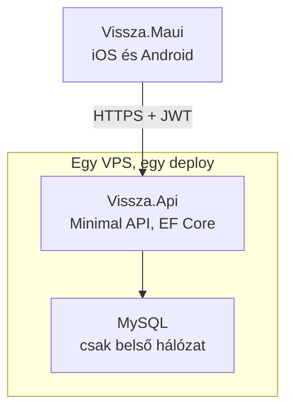
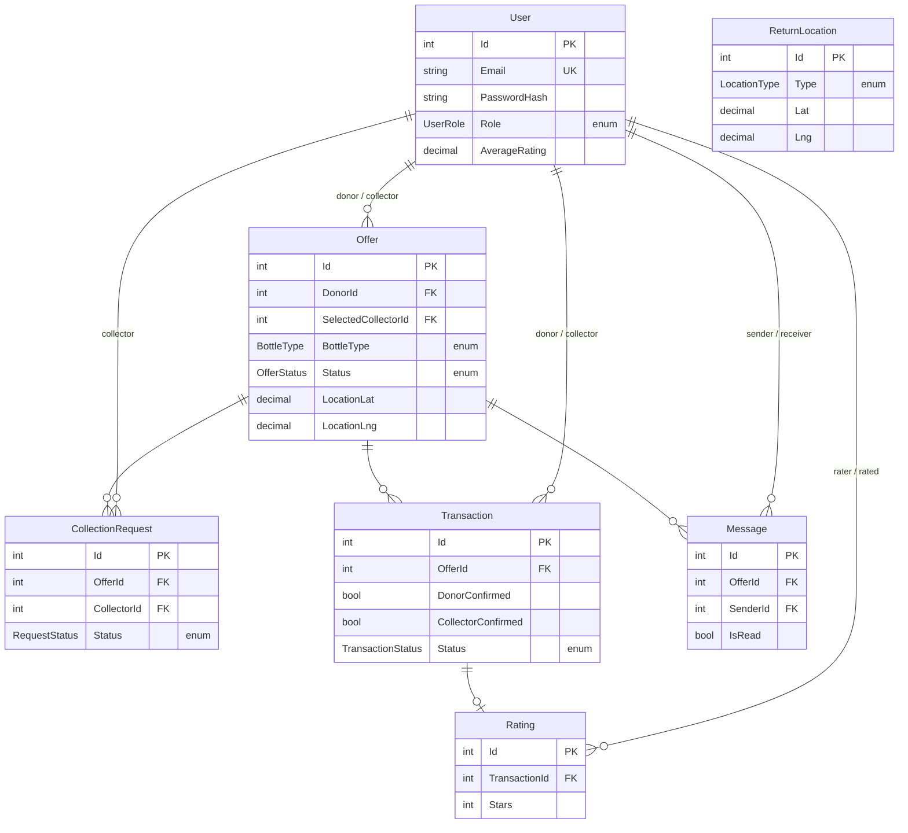

# ÜvegVissza — .NET MAUI migrációs terv

> Ez a dokumentum a React Native alapú `Desktop/vissza` projekt .NET MAUI-ra
> történő átírásának terve. A meglévő projekt nem módosul; a munka ebben a
> külön repóban folyik.
>
> Készült: 2026-08-01

---

## 1. Döntési napló

Ez a fejezet azt rögzíti, **miért** ez az architektúra — hogy fél év múlva ne
kelljen újra végigvitatni.

### 1.1 A cél

Egy .NET megoldás, egy nyelv, egy repo, egy deploy. Ne kelljen két külön
technológiai stacket (Node + React Native) karbantartani, és ne kelljen külön
gondolkodni a "frontend" és a "backend" projektről.

### 1.2 Elvetett: az app közvetlenül az adatbázishoz kapcsolódik

Az eredeti elképzelés az volt, hogy a MAUI code-behindból közvetlenül lehessen
lekérdezni a MySQL-t, backend nélkül — ahogy egy belsős LOB alkalmazásnál
szokás. **Elvetve**, négy okból:

1. **Nem spórol hostingot.** Az adatbázis ma is egy VPS-en fut, ugyanazon a
   gépen, mint az API. Az API eltávolítása nem szüntet meg egy szervert sem,
   csak a 3306-os portot kellene kinyitni a világ felé a 3000-es helyett.
2. **A connection string a felhasználó telefonjára kerülne.** Az APK/IPA
   visszafejtése triviális, a .NET IL assembly-k különösen. Ezzel bárki, aki
   telepítette az appot, hozzáférne minden felhasználó `email`, `phone`,
   `password_hash` és `default_address` mezőjéhez, az összes privát üzenethez,
   és tetszőlegesen módosíthatná vagy törölhetné az adatokat.
3. **Az üzleti szabályok kikényszeríthetetlenek lennének.** A kétoldalú átvételi
   megerősítés, a login rate limit és a tranzakciós atomicitás mind olyasmi, ami
   csak akkor ér valamit, ha a kliens nem tudja megkerülni.
4. **Connection pool.** Ma egyetlen kliens (a backend) tart 10 kapcsolatot.
   Direkt kapcsolódásnál minden telefon önálló kliens; a MySQL alapértelmezett
   `max_connections` értéke 151. Néhány száz egyidejű felhasználónál a szerver
   elutasítaná az új kapcsolatokat.

A LOB minta helyes — ott a kliens ismert gépen, zárt hálózaton fut. Itt idegenek
futtatják saját telefonon, publikus áruházból. Ez az egy változó dönt.

### 1.3 Elvetett: Blazor Server

Egyetlen ASP.NET Core projekt, a `.razor` fájl `@code` blokkjában közvetlen EF
Core lekérdezéssel — ez adná a legközelebbi élményt a LOB mintához, és a
térképréteget is megoldaná (Leaflet/MapLibre, tetszőleges HTML marker).
**Elvetve**, mert natív alkalmazás kell az App Store-ba és a Play Store-ba.

### 1.4 Elfogadott: MAUI + ASP.NET Core Minimal API egy solutionben

Egy `.sln`, három projekt, egy repo, egy deploy. A `Shared` projekt miatt a
szerver és a kliens fordítási időben ugyanazokat a típusokat használja — ez az,
amit a mostani JS/JS felállás nem tud nyújtani.

### 1.5 Elfogadott: a térkép platform handlerrel

Lásd a [7. fejezetet](#7-térkép-platform-handler). Három lehetőség közül
(platform handler, Mapsui, Maui.GoogleMaps) a **platform handler** a döntés:
teljes kontroll a natív térkép fölött, cserébe platformonkénti kód.

---

## 2. Cél architektúra



Kulcspontok:

- A telefon **soha nem beszél az adatbázissal**, csak az API-val, HTTPS-en.
- A MySQL portja kifelé zárva marad — csak az API éri el, ugyanarról a gépről.
- Az API és az adatbázis ugyanazon a szerveren fut, mint ma. **Nincs új
  üzemeltetési egység.**

> A konkrét szerver IP-cím, adatbázisnév és jelszavak nem kerülnek ebbe a
> repóba. Ezek a régi projekt `backend/.env` fájljában vannak, és az új
> API-ban is `.env` / user secrets / környezeti változó formájában maradnak.

---

## 3. A solution felépítése

```
vissza_maui/
├── MAUI_TERV.md
├── Vissza.sln
├── src/
│   ├── Vissza.Api/          ASP.NET Core Minimal API
│   │   ├── Endpoints/       végpontcsoportok (9 fájl)
│   │   ├── Entities/        EF Core entitások (scaffoldolt)
│   │   ├── Data/            VisszaDbContext
│   │   ├── Services/        jelszó, JWT, kép feltöltés
│   │   └── Program.cs
│   ├── Vissza.Shared/       DTO-k, enumok, validáció
│   │   ├── Dtos/
│   │   └── Enums/
│   └── Vissza.Maui/         MAUI alkalmazás
│       ├── Pages/           XAML oldalak
│       ├── ViewModels/
│       ├── Controls/        OfferCardView, térkép
│       ├── Platforms/       iOS és Android handler kód
│       ├── Services/        ApiClient, AuthService
│       └── Resources/       stílusok, ikonok
└── tests/
    └── Vissza.Api.Tests/
```

Projekthivatkozások: `Vissza.Api → Vissza.Shared` és `Vissza.Maui → Vissza.Shared`.
A `Shared` **nem** hivatkozik semmire, és nem tartalmaz EF Core-t —
csak POCO DTO-kat és enumokat.

### 3.1 Csomagok

| Projekt | Csomag | Mire |
|---|---|---|
| Api | `Pomelo.EntityFrameworkCore.MySql` | MySQL provider |
| Api | `BCrypt.Net-Next` | jelszó hash — a meglévő `bcryptjs` hashekkel kompatibilis |
| Api | `Microsoft.AspNetCore.Authentication.JwtBearer` | JWT validáció |
| Api | beépített `AddRateLimiter` | az `express-rate-limit` helyett |
| Maui | `CommunityToolkit.Mvvm` | `ObservableObject`, `RelayCommand` |
| Maui | `Refit.HttpClientFactory` | tipizált API kliens |
| Maui | `Microsoft.Maui.Controls.Maps` | térkép alap |

**Fontos:** a `BCrypt.Net-Next` ugyanazt a `$2a$`/`$2b$` formátumot olvassa, mint
a `bcryptjs`, tehát **a meglévő felhasználói jelszavak működni fognak** — nincs
szükség kényszerített jelszó-visszaállításra.

### 3.2 Fejlesztői környezet

- .NET SDK **10.0.302** (telepítve)
- `maui` workload **10.0.20** (telepítve)
- Szerkesztő: VS Code + .NET MAUI extension vagy Rider — a Visual Studio for Mac
  megszűnt, azzal ne számoljunk
- iOS buildhez továbbra is kell Xcode

---

## 4. Adatmodell

**A `schema.sql` nem változik.** Az EF Core visszafejti a meglévő adatbázisból:

```bash
dotnet ef dbcontext scaffold "<connection string>" \
  Pomelo.EntityFrameworkCore.MySql \
  -o Entities --context VisszaDbContext --context-dir Data
```



### 4.1 Az ENUM oszlopok

A séma öt ENUM oszlopa C# enummá válik a `Shared` projektben:

| MySQL oszlop | C# típus | Értékek |
|---|---|---|
| `users.user_role` | `UserRole` | `donor`, `collector`, `both` |
| `offers.bottle_type`, `transactions.bottle_type` | `BottleType` | `pet`, `glass`, `aluminum`, `other` |
| `offers.status` | `OfferStatus` | `active`, `reserved`, `completed`, `cancelled` |
| `collection_requests.status` | `RequestStatus` | `pending`, `accepted`, `rejected`, `cancelled` |
| `transactions.status` | `TransactionStatus` | `pending`, `completed`, `cancelled` |
| `return_locations.type` | `LocationType` | `automata`, `uzlet`, `gyujtopont` |

Ez egy egész hibaosztályt szüntet meg. A régi projektben előfordult, hogy a
MariaDB `STRICT_TRANS_TABLES` nélkül **csendben üres sztringre csonkolt** egy
ENUM-ban nem szereplő értéket, hibaüzenet nélkül. Enumokkal a rossz érték le sem
fordul a kliensen, az EF Core pedig kivételt dob csonkolás helyett.

---

## 5. API végpontok

31 végpont, 9 `MapGroup` csoportban — pontosan a mostani route fájlok szerint.

| Csoport | Db | Végpontok |
|---|---|---|
| `/api/auth` | 4 | `POST /register`, `POST /login`, `GET /me`, `PUT /me` |
| `/api/offers` | 5 | `GET /`, `GET /{id}`, `POST /`, `PUT /{id}`, `DELETE /{id}` |
| `/api/messages` | 6 | `GET /`, `POST /`, `GET /unread-count`, `GET /conversations`, `PUT /{id}/read`, `DELETE /{id}` |
| `/api/ratings` | 5 | `GET /`, `GET /{id}`, `POST /`, `PUT /{id}`, `DELETE /{id}` |
| `/api/transactions` | 4 | `GET /`, `GET /{id}`, `POST /`, `PUT /{id}` |
| `/api/collection-requests` | 3 | `GET /`, `POST /`, `PUT /{id}` |
| `/api/return-locations` | 2 | `GET /`, `GET /{id}` — publikus, nem kell token |
| `/api/upload` | 1 | `POST /` |
| `/api/users` | 1 | `GET /{id}` |

### 5.1 Amit át kell menteni a régi backendből

Ezek nem "extrák", hanem korábban megtalált és javított hibák. A migrációnál
nem szabad elveszni:

- **Tranzakciós atomicitás** — az átvételi folyamat egyetlen adatbázis-
  tranzakcióban fut. `Database.BeginTransactionAsync()` + `SaveChangesAsync()`.
- **Kétoldalú megerősítés** — a `transactions.status` csak akkor lesz
  `completed`, ha `donor_confirmed` ÉS `collector_confirmed` is igaz.
  Szerveroldali ellenőrzés, nem kliensoldali.
- **Login rate limit** — `AddRateLimiter` fix ablakkal a `/api/auth/login`-ra.
- **JWT titok kötelező** — az alkalmazás induljon el hibával, ha nincs
  beállítva, ne legyen fallback érték.
- **N+1 lekérdezések elkerülése** — a listavégpontok a régi projektben batch
  betöltést használnak. EF Core-ban ez `Include()` / projekció.
- **Részleges frissítés** — a `PUT` végpontok ne dobjanak 500-at, ha csak néhány
  mező érkezik.

### 5.2 Képfeltöltés

A `multer` helyett `IFormFile` + `app.UseStaticFiles()`. A képek maradnak helyi
lemezen a szerveren, ugyanabban a mappában, ugyanazzal az URL sémával — így a
meglévő `photo_url` és `profile_image` értékek érvényesek maradnak.

---

## 6. Képernyők leképezése

11 képernyő, 21 forrásfájl, ~8600 sor.

| Jelenlegi | Sor | MAUI megfelelő | Térkép? |
|---|---:|---|:---:|
| `CollectScreen.js` | 1449 | `CollectPage` + `CollectViewModel` | igen |
| `GiveScreen.js` | 1271 | `GivePage` + `MediaPicker` | igen |
| `SettingsScreen.js` | 926 | `SettingsPage` | — |
| `DashboardScreen.js` | 803 | `DashboardPage` | igen |
| `TransactionDetailScreen.js` | 565 | `TransactionDetailPage` | — |
| `OfferDetailScreen.js` | 564 | `OfferDetailPage` | — |
| `ChatScreen.js` | 454 | `ChatPage` | — |
| `RegisterScreen.js` | 388 | `RegisterPage` | — |
| `ConversationsScreen.js` | 344 | `ConversationsPage` | — |
| `RatingScreen.js` | 296 | `RatingPage` | — |
| `LoginScreen.js` | 255 | `LoginPage` | — |

Támogató rétegek:

| Jelenlegi | Sor | MAUI megfelelő | Megjegyzés |
|---|---:|---|---|
| `api.js` | 311 | `IVisszaApi` (Refit) | interfész + attribútumok, ~80 sor |
| `theme/index.js` + `ThemeContext.js` | 227 | `ResourceDictionary` + `AppThemeBinding` | a sötét mód beépített |
| `OfferCard.js` | 233 | `OfferCardView` (`ContentView`) | |
| `AppNavigator.js` | 166 | `AppShell.xaml` | kevesebb kód |
| `AuthContext.js` | 108 | `AuthService` + `SecureStorage` | biztonságosabb tokentárolás |
| `timeUtils.js` | 102 | `IValueConverter`-ek | |
| `config/database.js` | 33 | `appsettings.json` | csak API base URL |
| `bottleTypes.js` | 30 | `Shared/Enums` | a szerverrel közösen |

### 6.1 Amit érdemes útközben feljavítani

- **Chat polling → SignalR.** A jelenlegi `ChatScreen` `setInterval`-lal kérdezi
  le az üzeneteket. ASP.NET Core-ral a SignalR gyakorlatilag ingyen van, és
  valós idejűvé teszi a beszélgetést.
- **Push értesítés.** A `users.notifications_enabled` és `notification_radius`
  oszlopok már megvannak, de nincs mögöttük tényleges értesítés.

Egyik sem az 1-4. fázis része — a migráció után jönnek.

---

## 7. Térkép: platform handler

**Ez a terv legkockázatosabb eleme, ezért kerül az első fázisba.**

### 7.1 A probléma

A `Microsoft.Maui.Controls.Maps` `Map` kontrollja csak `Pin`-t ismer: cím,
felirat, típus. A jelenlegi app viszont **saját nézeteket rajzol markerként** —
a téma elsődleges színével festett kört, benne ikonnal, a `DashboardScreen` és a
`CollectScreen` térképein. Emellett a térkép sötét módban követi az app témáját.

Ami a beépített kontrollal **működik**:

- `Circle`, `Polyline`, `Polygon` `MapElement`-ként — a sugárkör megvan
- kamera pozicionálás, felhasználó helyzete

Ami **nem**:

- tetszőleges nézet markerként
- a térkép sötét stílusa

### 7.2 A megoldás

Saját handler, ami a natív térképobjektumot éri el:

| Platform | `PlatformView` | Marker testreszabás |
|---|---|---|
| iOS | `MKMapView` | `GetViewForAnnotation` → saját `MKAnnotationView`, `Image` tulajdonsággal |
| Android | `Android.Gms.Maps.GoogleMap` | `MarkerOptions.SetIcon(BitmapDescriptorFactory.FromBitmap(...))` |

Regisztráció a `MauiProgram.cs`-ben:

```csharp
builder.ConfigureMauiHandlers(handlers =>
    handlers.AddHandler<Map, VisszaMapHandler>());
```

Vagy nem-invazívan, a meglévő handler kiegészítésével:

```csharp
MapHandler.Mapper.AppendToMapping("VisszaPins", (handler, map) =>
{
    // platformspecifikus beállítás a handler.PlatformView-n
});
```

**A marker bitmap közös kódból.** Ahelyett, hogy iOS-en és Androidon külön
rajzolnánk a markert, a `Microsoft.Maui.Graphics` segítségével egyszer
generáljuk a képet (kör + ikon + témaszín), és mindkét platform ugyanazt a
bitmapet kapja. Így a platformkód csak annyi, hogy "ezt a bitmapet tedd ide" —
a megjelenés egy helyen van definiálva.

**Sötét stílus:**

- Android: `GoogleMap.SetMapStyle(new MapStyleOptions(json))` — a jelenlegi
  projekt stílus-JSON-ja átvihető
- iOS: `MKMapView.OverrideUserInterfaceStyle` az app témájához igazítva

**Android beállítás:** Google Maps API kulcs kell az `AndroidManifest.xml`-be,
és `builder.UseMauiMaps()` a `MauiProgram`-ban.

### 7.3 Mit kell a spike-nak bizonyítania

A 0. fázis akkor sikeres, ha egy eldobható MAUI appban **mindkét platformon**:

1. megjelenik a térkép a felhasználó helyzetével
2. legalább 20 saját, színes marker látszik rajta, akadás nélkül
3. markerre koppintva megnyílik egy részletpanel
4. a sugárkör (`Circle`) rajzolódik
5. sötét módban a térkép is sötét

Ha bármelyik pont nem megy ésszerű időn belül, **itt állunk meg és újra döntünk**
(Mapsui vagy Maui.GoogleMaps) — nem a 3. fázis közepén, 11 oldal megírása után.

---

## 8. Ütemezés

| Fázis | Tartalom | Becslés |
|---|---|---|
| **0. Térkép spike** | Eldobható app, a 7.3 öt pontja iOS-en és Androidon | 3-4 nap |
| **1. Api + Shared** | Scaffold, 31 végpont, JWT, BCrypt, tranzakciók, rate limit | 1-1,5 hét |
| **2. Maui váz** | Shell navigáció, Refit kliens, `AuthService`, téma, `OfferCardView` | 3-4 nap |
| **3. Képernyők** | 11 oldal + ViewModelek | 2-3 hét |
| **4. Kiadás** | Signing, App Store / Play Console, deploy a VPS-re | 3-4 nap |
| | **Összesen** | **5-7 hét** |

A becslés egy főre, fókuszált munkára vonatkozik, és feltételezi, hogy a 0.
fázis sikerül. Ha a platform handler útja elakad, a térképréteg +1-2 hét.

---

## 9. Nyitott kérdések

- **Google Maps API kulcs** — Androidhoz kell egy, a régi projektben van;
  megosztjuk vagy újat kérünk?
- **HTTPS a VPS-en** — ma az API `http://`-n megy. A MAUI app App Transport
  Security miatt iOS-en HTTPS-t vár. Kell egy tanúsítvány (Let's Encrypt) és
  egy domain az IP helyett. Ezt az 1. fázisban érdemes rendezni.
- **Párhuzamos üzem** — a régi RN app és az új MAUI app egy ideig ugyanazt az
  adatbázist használná. Mivel az API szerződés nem változik, ez működik, de a
  két API-t (Node és .NET) külön porton kell futtatni az átállás alatt.
- **Migráció vagy párhuzamos fejlesztés** — leáll a régi projekt fejlesztése az
  átállás idejére, vagy megy tovább? Ha megy, a két kódbázis szétcsúszik.

---

## 10. Következő lépés

**0. fázis: térkép spike.** Semmilyen üzleti logika nem íródik meg addig, amíg a
saját marker nem működik mindkét platformon.
